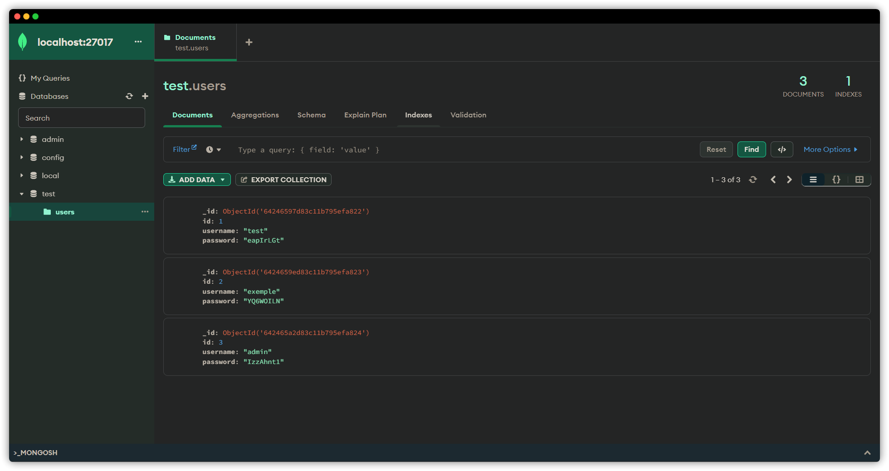
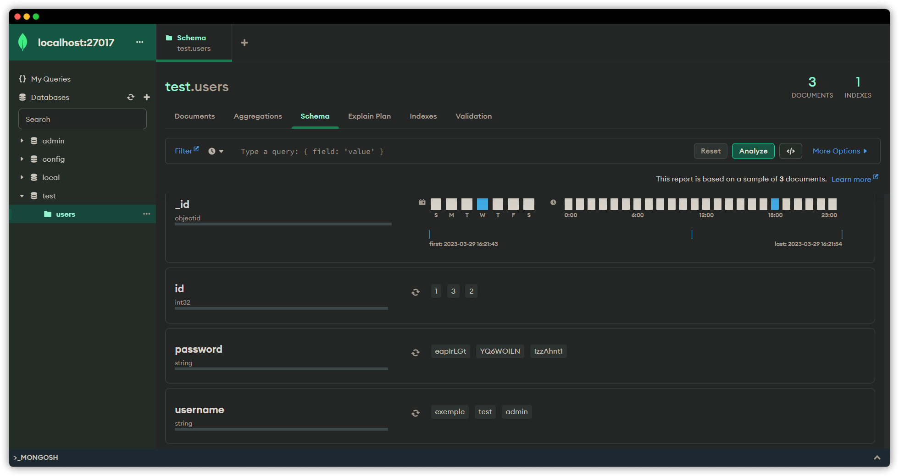
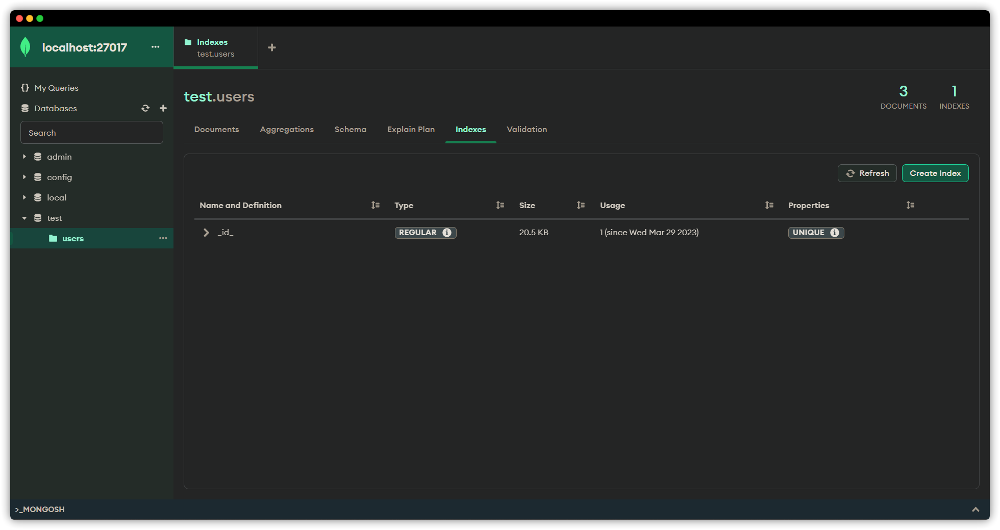

# GestionUser

## Description ✨

Ce programme est une application de gestion des utilisateurs utilisant Tkinter et MongoDB. Il permet d'ajouter, de supprimer et de mettre à jour les utilisateurs avec leur mot de passe.

### Différence entre SQL et NoSQL

*Pour les utilisateurs qui ne connaissent pas le Language NoSQL*

Il faut imaginer que tu as une boîte avec des données (comme des informations sur des personnes, des produits, etc.). Il existe plusieurs façons de ranger ces données dans cette boîte. SQL et NoSQL sont deux méthodes différentes pour organiser et manipuler ces données.

SQL (Structured Query Language) est une approche qui utilise des tableaux (un peu comme des feuilles de calcul Excel) pour organiser les données. Chaque tableau a des colonnes et des lignes, et les données sont rangées de manière très structurée. Les colonnes définissent les types d'informations (par exemple, nom, âge, adresse), et les lignes représentent chaque entrée (par exemple, chaque personne). Cette approche est utilisée par des bases de données relationnelles comme MySQL, PostgreSQL et SQL Server.

NoSQL (Not Only SQL) est une approche plus flexible pour organiser les données. Au lieu d'utiliser des tableaux, NoSQL utilise différentes structures pour stocker les données, comme des documents, des paires clé-valeur, des graphes ou des colonnes larges. Cette approche est utilisée par des bases de données non-relationnelles comme MongoDB, Cassandra et Redis.

En résumé, la principale différence entre SQL et NoSQL réside dans la manière dont les données sont organisées et gérées. SQL est plus structuré et utilise des tableaux pour organiser les données, tandis que NoSQL est plus flexible et utilise diverses structures pour stocker les informations.

### Avantage pour NoSQL

- **Flexibilité** : Les bases de données NoSQL sont plus flexibles en termes de structure des données, car elles n'exigent pas de schéma fixe. Cela permet d'ajouter, de modifier ou de supprimer des types d'informations sans avoir à modifier toute la structure de la base de données.

- **Scalabilité** : Les bases de données NoSQL sont conçues pour fonctionner efficacement sur plusieurs serveurs et pour gérer de grands volumes de données. Elles peuvent être facilement étendues en ajoutant de nouveaux serveurs au système, ce qui permet de mieux gérer la croissance des données et du trafic.

- **Haute disponibilité** : La plupart des bases de données NoSQL prennent en charge la réplication des données sur plusieurs serveurs, ce qui permet une meilleure tolérance aux pannes et une récupération rapide en cas de défaillance d'un serveur.

- **Performance** : Pour certaines applications, les bases de données NoSQL peuvent offrir de meilleures performances, en particulier lorsqu'il s'agit de lire ou d'écrire de grandes quantités de données ou de traiter des données semi-structurées ou non structurées.

- **Adaptabilité** : Les bases de données NoSQL peuvent être mieux adaptées à certaines situations ou problèmes spécifiques, comme le traitement des données en temps réel, la gestion des réseaux sociaux ou des données de capteurs, où les relations entre les données sont complexes ou changeantes.

Cependant, il est important de noter que NoSQL n'est pas toujours la meilleure solution pour tous les projets. Les bases de données SQL peuvent être plus appropriées lorsque les données sont fortement structurées, que les relations entre les données sont importantes, ou que des transactions complexes et des requêtes d'analyse sont nécessaires. 
## Prérequis ❓

- Python 3
- Tkinter
- ttkbootstrap
- pymongo

## Fonctionnalités 🚀

- Ajouter un nouvel utilisateur avec un mot de passe aléatoire
- Supprimer un utilisateur sélectionné
- Mettre à jour le nom d'utilisateur ou le mot de passe d'un utilisateur sélectionné
- Masquer les mots de passe avec des astérisques dans la table des utilisateurs

## Utilisation 👨‍💻

Clonez ou téléchargez ce dépôt :

```cmd
git clone https://github.com/Foufou-exe/GestionUser
```

Installez les dépendances en exécutant :

```python
pip install -r requirements.txt
```

Exécutez le fichier gestionUser.py :

```cmd
python gestionUser.py
```

### Exemple utilisation ✨


## Interface utilisateur👌

L'interface utilisateur comprend :

- Un champ de saisie pour le nom d'utilisateur
- Un bouton "**Ajouter**" pour ajouter un nouvel utilisateur
- Un bouton "**Supprimer**" pour supprimer l'utilisateur sélectionné
- Un champ de saisie pour la valeur à mettre à jour (*nom d'utilisateur ou mot de passe*)
- Un bouton "**Mettre à jour**" pour mettre à jour la valeur sélectionnée
- Une table affichant les utilisateurs avec leurs ID, noms d'utilisateur et mots de passe masqués

### Visuel GestionUser


## Code

Le code principal est divisé en plusieurs fonctions pour gérer les différentes fonctionnalités de l'application :

- `add_user()` : ajoute un nouvel utilisateur à la base de données avec un mot de passe aléatoire.

- `delete_user()` : supprime l'utilisateur sélectionné dans la table des utilisateurs.

- `update_users_table()` : met à jour la table des utilisateurs avec les données de la base de données.

- `update_user()` : met à jour l'utilisateur sélectionné dans la table des utilisateurs (nom d'utilisateur ou mot de passe).
mask_password(password): masque le mot de passe avec des astérisques.
get_selected_values(event): récupère les valeurs sélectionnées dans la table des utilisateurs lorsqu'un utilisateur clique sur une cellule de la table.

- `main()` : fonction principale qui gère l'interface utilisateur et les interactions utilisateur.

## Structure du code

Le code est structuré de la manière suivante :

- Importation des modules nécessaires

```python
# Importer les modules
import tkinter as tk
from tkinter import *
from ttkbootstrap import *
import tkinter.ttk as ttk
import random
import string
import os
import platform
import sys
from pymongo import MongoClient
```

- Connexion à la base de données MongoDB et création de la collection "users" si elle n'existe pas

```python
uri = "mongodb://localhost:27017"

client = MongoClient(uri)

db = client["test"]

validator = {
    "$jsonSchema": {
        "bsonType": "object",
        "required": ["username", "password"],
        "properties": {
            "id": {"bsonType": "int"},
            "username": {"bsonType": "string"},
            "password": {"bsonType": "string"},
        },
    }
}

if "users" not in db.list_collection_names():
    db.create_collection("users", validator=validator)
```

- Définition des fonctions pour gérer les fonctionnalités de l'application

```python
def add_user():
    """Ajouter un nouvel utilisateur à la base de données"""
    name = user_entry.get()
    if name:
        # Récupérer l'ID du dernier utilisateur ajouté
        last_user = db.users.find().sort("id", -1).limit(1)
        last_id = 0
        for user in last_user:
            last_id = user["id"]

        # Extraire le numéro à partir de l'ID et l'incrémenter
        new_num = last_id + 1

        # Générer un mot de passe aléatoire
        password = "".join(random.choices(string.ascii_letters + string.digits, k=8))

        # Insérer un nouveau document utilisateur dans la collection
        db.users.insert_one({"id": new_num, "username": name, "password": password})

        update_users_table()
        user_entry.delete(0, tk.END)

def delete_user():
    """Supprimer l'utilisateur sélectionné dans la table des utilisateurs"""
    selected_user = users_table.item(users_table.selection())["values"][0]
    db.users.delete_one({"id": selected_user})
    update_users_table()

```

- Définition de la fonction principale main() qui gère l'interface utilisateur et les interactions utilisateur

```python
def main():
    """Fonction principale"""
    global users_table, update_entry, user_entry
    try:
        root = tk.Tk()
        root.theme = Style(theme="superhero")
        root.title("Gestion des utilisateurs")
        root.geometry("1280x720")

        root.grid_rowconfigure(0, weight=1)
        root.grid_columnconfigure(0, weight=1)

        chemin_python = os.path.abspath(__file__)

        repertoire_travail = os.path.dirname(chemin_python)
        if platform.system() == "Windows":
            file_path_icon3 = os.path.join(repertoire_travail, "images/code.ico")
            root.iconbitmap(root, default=file_path_icon3)
        else:
            file_path_icon3 = os.path.join(repertoire_travail, "images/code.png")
            root.iconphoto(root, default=PhotoImage(file=file_path_icon3))

        frame = ttk.Frame(root, padding=10)
        frame.grid(row=0, column=0, sticky=tk.NSEW)

        for i in range(4):
            frame.grid_columnconfigure(i, weight=1)
        frame.grid_rowconfigure(1, weight=1)

        user_label = ttk.Label(frame, text="Nom d'utilisateur :")
        user_label.grid(row=0, column=0, padx=(0, 10), sticky=tk.W)

        user_entry = ttk.Entry(frame)
        user_entry.grid(row=0, column=0, padx=(110, 10), sticky=tk.W)

        add_button = ttk.Button(frame, text="Ajouter", command=add_user)
        add_button.grid(row=0, column=0, padx=(250, 0), sticky=tk.W)

        delete_button = ttk.Button(frame, text="Supprimer", command=delete_user)
        delete_button.grid(row=0, column=0, padx=(320, 0), sticky=tk.W)

        update_label = ttk.Label(frame, text="Valeur à mettre à jour :")
        update_label.grid(row=0, column=1, padx=(0, 10), sticky=tk.W)

        update_entry = ttk.Entry(frame)
        update_entry.grid(row=0, column=1, padx=(130, 10), sticky=tk.W)

        update_button = ttk.Button(frame, text="Mettre à jour", command=update_user)
        update_button.grid(row=0, column=1, padx=(270, 0), pady=(0, 0), sticky=tk.W)

        users_table = ttk.Treeview(
            frame,
            columns=("ID", "Username", "Password"),
            show="headings",
        )
        users_table.heading("ID", text="ID")
        users_table.heading("Username", text="Nom d'utilisateur")
        users_table.heading("Password", text="Mot de passe")
        users_table.column("ID", width=100, anchor=tk.CENTER)
        users_table.column("Username", width=200, anchor=tk.CENTER)
        users_table.column("Password", width=300, anchor=tk.CENTER)
        users_table.grid(row=1, column=0, columnspan=4, pady=(10, 0), sticky=tk.NSEW)
        users_table.bind("<Button-1>", get_selected_values)

        update_users_table()
    except Exception(KeyboardInterrupt, SystemExit):
        root.destroy()
        sys.exit(0)
    root.mainloop()
```

- Exécution de la fonction principale main() si le fichier est exécuté en tant que script principal

```python
if __name__ == "__main__":
    main()
```

## Base de Donnée (MongoDB)

### Installation MongoDB avec Docker 🐋

Initialisation de la Base de donnée avec Docker :

```cmd
docker run --name mongodb -d -p 27017:27017 mongodb/mongodb-community-server:latest
```

### Visualisation avec Compass MongoDB

Pour ma part, j'utilise Compass MongoDB pour visualisé la Base de donnée en local:

#### Base Test



#### Collection users



#### Indexe



## Licence

Ce projet est sous licence MIT. Voir le fichier `LICENSE` pour plus de détails.
